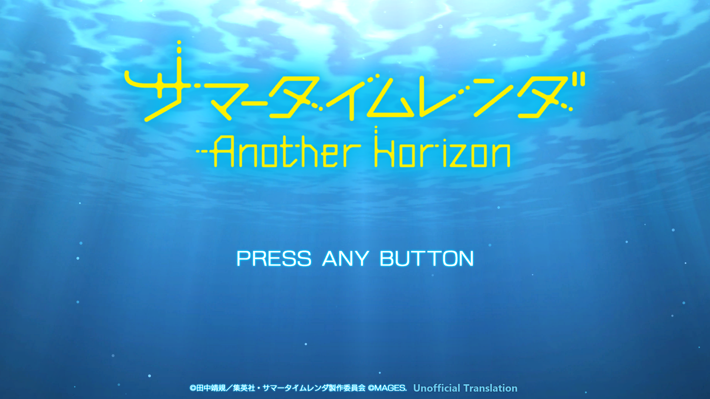
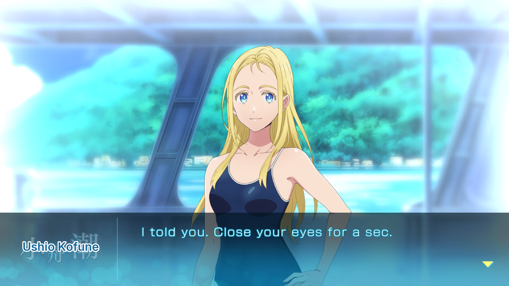
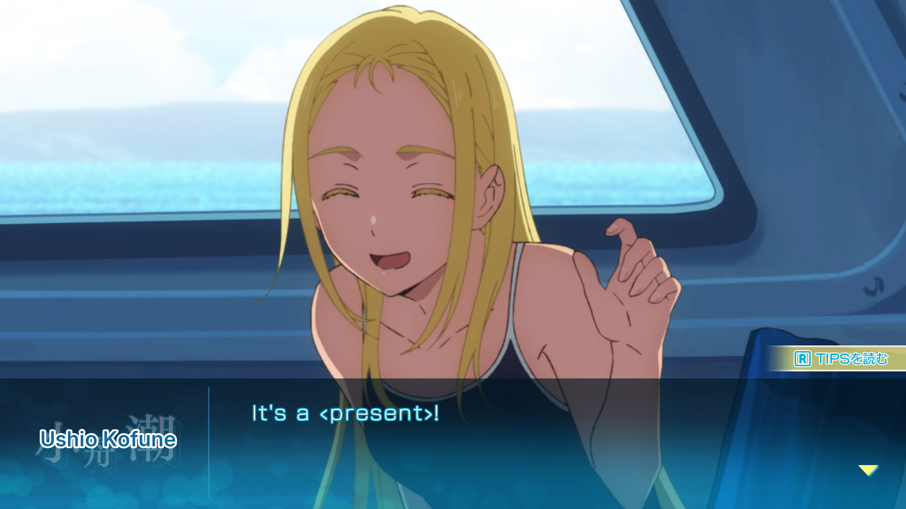
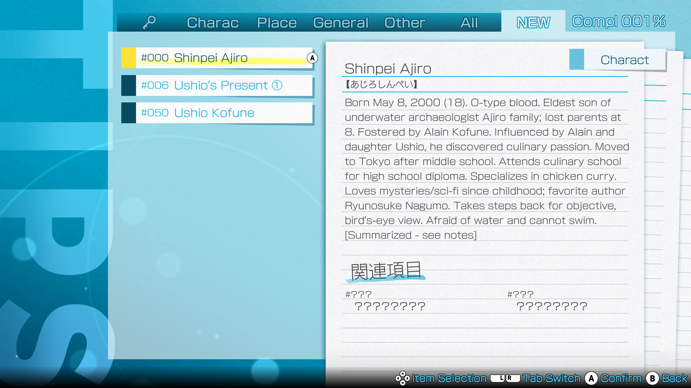

# Screenshots

The English patch running on a Nintendo Switch. Click any image for the
full-resolution version.

> ⚠️ Mild spoilers only — all shots are from the opening of the game.

## Title screen

The original title logo is left untouched. The footer carries an "Unofficial
Translation" note alongside the original copyright line.

## Dialogue

Dialogue is pre-wrapped to fit the game's text box, which does not wrap text on
its own. The speaker's name plate ("Ushio Kofune") is not text at all — it is an
**image** in the game's assets, so the English name is composited over the
dimmed original artwork. All 135 name plates are localized this way.

## TIPS keywords in dialogue

Terms that have a TIPS encyclopedia entry are marked with **‹guillemets›**
rather than the original's gold highlight color, which did not render correctly
over English text. The "new TIPS entry found" prompt still fires as normal.

## TIPS encyclopedia

The TIPS box can only display ten lines, so a handful of the longest entries are
condensed and end with `[Summarized - see notes]`. The complete, unabridged text
of **every** entry is on the [TIPS Reference](TIPS_reference.html) page.
